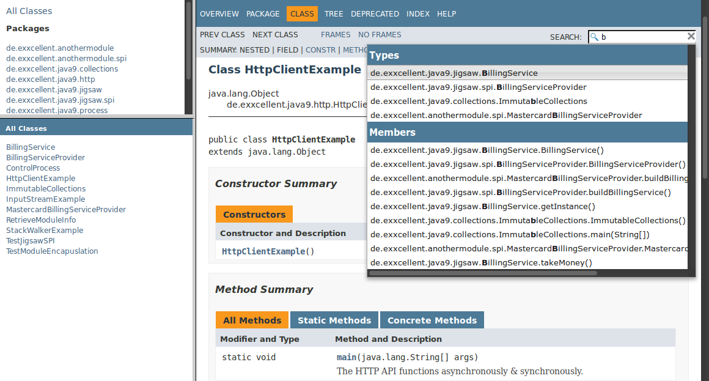

```{r setup, include=FALSE}
knitr::opts_chunk$set(echo = FALSE)
knitr::opts_chunk$set(warning = FALSE)
knitr::opts_chunk$set(message = FALSE)
library("gym.plantuml")

```

### 如何阅读我？

* 大家看到`右下角`箭头了吗？向左的箭头表示下一章节，向下的箭头表示下一页
* 看到`左下角`的菜单了吗，可以随意穿梭于整个文档
* 那么开始愉快的阅读吧！

## 工具类

### REPL: jshell
在JDK9中，多了一个jshell的可执行文件，可以像运行脚本一样解释执行Java，是不是很酷？
```{.java}
⋊> ~ jshell
|  Welcome to JShell -- Version 9-ea
|  For an introduction type: /help intro

jshell> 3 + 4 * 7
$1 ==> 31

jshell> int add(int a, int b) {
...>   return a+b;
...> }
|  created method add(int,int)

jshell> add(25, $1)
$3 ==> 56
```

可以使用 `/help` 或者 `/help shortcuts`得到更多帮助信息

### HTML5 Javadoc
* 通过 `-html5` 参数启用HTML5 javadoc 新特性
* 梦幻般的搜索功能
* HTML5 & updated Doclet API
* 增强的DocLint: `-Xdoclint/package:java.\*,javax.\*`

### HTML5 Javadoc 一睹为快


### 交叉编译
`javac - release N`

等价于

`javac -source N -target N –bootclasspath rtN.jar ...`

### 语言增强.
* 进程控制 [ControlProcess.java](https://github.com/bentolor/java9-in-action/blob/master/playground/src/main/java/de/exxcellent/java9/process/ControlProcess.java)
* 增强集合操作[ImmutableCollections.java](https://github.com/bentolor/java9-in-action/blob/master/playground/src/main/java/de/exxcellent/java9/collections/ImmutableCollections.java)
    * `List/Map/Set.of(1, 2, 3);`
* StackWalker [StackWalkerExample.java](https://github.com/bentolor/java9-in-action/blob/master/playground/src/main/java/de/exxcellent/java9/util/StackWalkerExample.java)

### 语言增强..
* 获得包名
    * `this.getClass().getPackageName()`
* 增强的Deprecated
    * `@Deprecated(since ="1.5", forRemoval = true)`
* HTTP/2 Client

### 进程控制
```{.java}
// Get PIDs of own or started processes
out.println("Your pid is " + ProcessHandle.current().getPid());

Process p = Runtime.getRuntime().exec("sleep 1h");
ProcessHandle h = ProcessHandle.of(p.getPid())  // Optional
        .orElseThrow(IllegalStateException::new);

// Do things on exiting process          // CompletableFuture
h.onExit().thenRun( ()-> out.println("Sleeper exited") );

// Get info on process
out.printf("[%d] %s - %s\n", h.getPid(),
           h.info().user().orElse("unknown"),
           h.info().commandLine().orElse("none"));

// Kill a process
h.destroy();
```

### 增强集合操作
```{.java}
/* Comment sections would break ... */
List<Integer> listOfNumbers = List.of(1, 2, 3, 4, 5/*, null*/);

Set<Integer> setOfNumbers = Set.of(1, 2, 3, 4, 5/*, 1*/);

Map<String, String> mapOfString =
    Map.of("key1", "value1", "key2", "value2");

Map<String, String> moreMapOfString =
    Map.ofEntries(
        Map.entry("key1", "value1"),
        Map.entry("key2", "value2")/*,
        Map.entry("key1", "value3")*/
);
```

### StackWalker
```{.java}
// return class/method only for our classes.
private static List<String> walkAndFilterStackframe() {
  return StackWalker.getInstance().walk(s ->
    s.map( frame-> frame.getClassName()+"/"+frame.getMethodName())
           .filter(name -> name.startsWith("de.exxcellent"))
           .limit(10)
           .collect(Collectors.toList()) );
}
```

### HTTP/2 Client
```{.java}
/**
 * The HTTP API functions asynchronously & synchronously. In
 * asynchronous mode, work is done in threads (ExecutorService).
 */
public static void main(String[] args) throws Exception {
  HttpClient.getDefault()
    .request(URI.create("https://www.exxcellent.de"))
    .GET()
    .responseAsync() // CompletableFuture :D
    .thenAccept(httpResponse ->
        out.println(httpResponse.body(HttpResponse.asString()))
    );
  Thread.sleep(999); // Give worker thread some time.
}
```


## 令人兴奋的JIGSAW


### 什么是JIGSAW
* Java的模块化系统。提供比Jar更好的封装性。
* public方法不在对外public
* 暂无模块版本支持

### JIGSAW之Hello World(1)
`module-info.java` 文件用于定义依赖
```{.java}
module com.mysql.jdbc {
    // Module dependency
    requires java.sql;

    // exported package in module
    exports com.mysql.jdbc;

    // Implements service with instance
    provides java.sql.Driver with com.mysql.jdbc.Driver;
}
```

### JIGSAW之Hello World(2)
* 在`javac`和`java`中启用模块支持
```
javac -mp modulepath ...
java  -mp modulepath -m modulename/moduleclass
```

* 链接
    * `jlink`用于链接一组模块，同时，它也能处理模块的传递依赖。
    
### 使用模块的ServiceLoader(1)
```{.java}
public abstract class BillingService {

  public static BillingService getInstance() {
    // Java SPI to find the instance
    ServiceLoader<BillingServiceProvider> sl =
       ServiceLoader.load(BillingServiceProvider.class);

    // Fetch first provider implementation
    Iterator<BillingServiceProvider> it = sl.iterator();

    return it.next().buildBillingService();
  }

  public abstract String takeMoney();
}
```

### 使用模块的ServiceLoader(2)
```{.java}
module anothermodule {
  exports de.exxcellent.anothermodule;
  requires de.exxcellent.java9;

  // Provide Service instance (SPI with Jigsaw modules)
  provides de.exxcellent.java9.jigsaw.spi.BillingServiceProvider
  with de.exxcellent.anothermodule.spi.MastercardBillingServiceProvider;
}
```


### JIGSAW之Hello World(3)
```{.bash}
$ mkdir -p target/module/de.exxcellent.java9
$ mkdir -p target/module/anothermodule

$ javac $(find playground/src/main/java -name "*.java") \
        -d target/module/de.exxcellent.java9
$ javac $(find playground-dependent/src/main/java -name "*.java")\
        -d target/module/anothermodule \
        -modulepath target/module

$ java  -modulepath target/module \
        -m anothermodule/de.exxcellent.anothermodule.TestJigsawSPI
Mastercard billed the money!
```

### JIGSAW相关工具
* 列出内置模块: `java –listmods`
* 查找依赖:`jdeps –jdkinternals app.jar`


## 参考(https://bentolor.github.io/java9-in-action)


